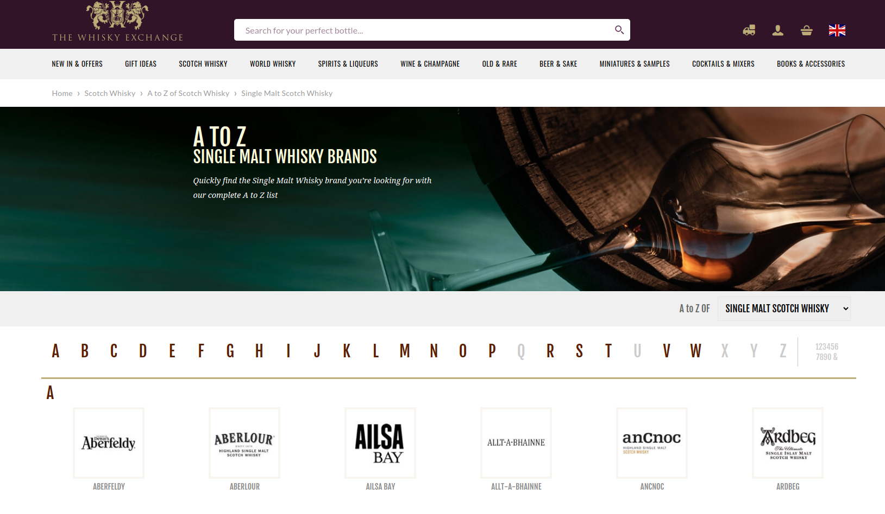
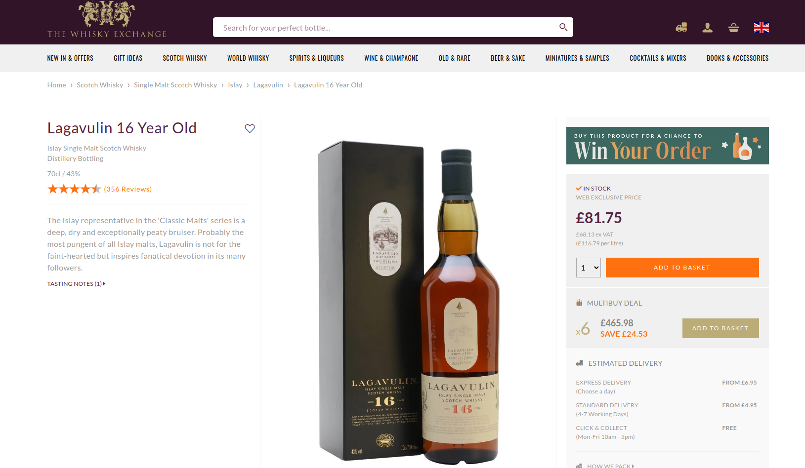
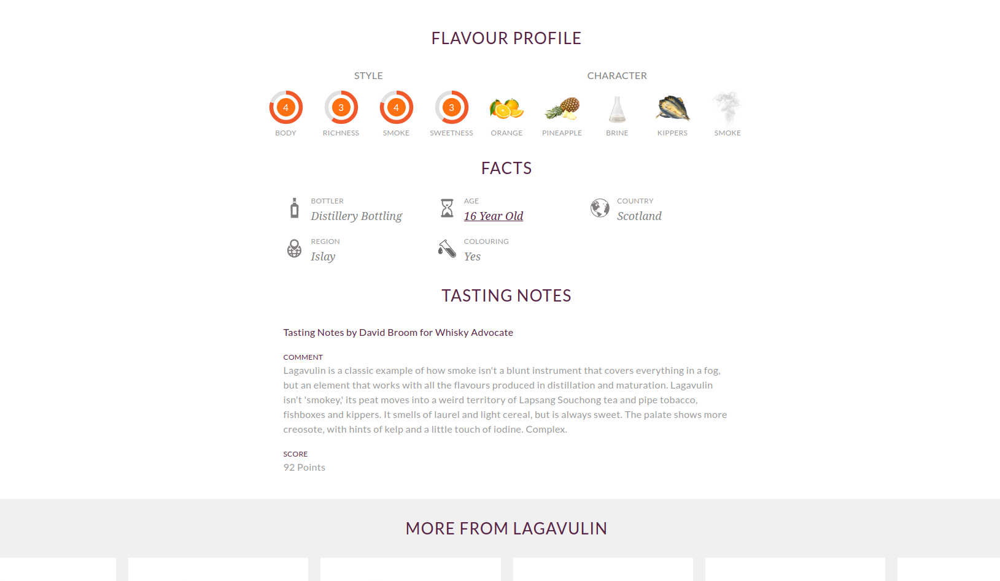

# Data Collection Pipeline
## The Whisky Exchange Webscraper project

Technologies used:

 
[](https://svgshare.com/i/Zhy.svg) 
 
 
 
 
  
 (PostgreSQL)
 (RDS, S3, EC2) 


### Milestone 1 & 2
#### Set up environment and Decide which website to collect data from
My major interests are magic the gathering, video games, brazilian jiu-jitsu, whisky, biology. From this selection I looked at possibilities to collect valuable data that may be of interest to an industry. Some options were:

1. Cardmarket.com - buying and selling of collectible trading cards. I was interested in the Magic: The Gathering market. This would be mostly looking at prices across card variants and condition.
2. tracker.gg - video game stats tracker. Looking at different player's skills and 
3. beltchecker.com - check BJJ players and their achieved belts
4. rcsb.org/ - Protein Data bank
5. thewhiskyexchange.com - spirits database with flavour profile

I went with whiskeyexchange as the website seemed well set up, would use a webscraper not an API and would be within my level of ability to analyze and create insights with. 

### Milestone 3
#### Prototype finding the individual page for entry

Selenium is an open-source tool that automates web browsers. The selenium webdriver drives a browser natively, as a user would.
Using Selenium for Chrome, I wrote methods to build a webscraper in Python. I created a Scraper class and wrote init and an 'accept cookies' method to click the accept cookies popup banner. I set 'headless' mode in the options which means it runs without the typical browser interface.

Selenium has multiple ways to find elements on a page. One of the most reliable ways is through the XPATH. Xpaths can be absolute or relative. An absolute xpath would be:
/html/body/div[2]/div[1]/div/h4[1]/b/html[1]/body[1]/div[2]/div[1]/div[1]/h4[1]/b[1]

while a relative xpath would be : 
//div[@class='featured-box cloumnsize1']//h4[1]//b[1]

Absolute paths are precise however any changes made to the site will invalidate them, so they are not much use for a longer term project unless the website html is static. Even in relative xpaths, the tag such as 'div' or 'h1' (heading 1) could change. I stuck to using //* as a wild card and finding specific elements as, assuming the website creator used the good practice of using unique names for elements, I would not have any issues.

```
class Scraper():

   def __init__(self) -> None:
        # selenium webdriver setup
        options = Options()
        options.add_argument('--headless')
        self.driver = webdriver.Chrome(options=options)
        URL = 'https://www.thewhiskyexchange.com/brands/scotchwhisky/40/single-malt-scotch-whisky'
        self.driver.get(URL)
        time.sleep(2)


    # Start up selenium webdriver with options. Open main page and accept cookies. 
    def load_and_accept_cookies(self):

        try: 
            accept_cookies = self.driver.find_element(By.XPATH, '//button[@data-tid="banner-accept"]')
            accept_cookies.click()
```
While I wanted to specifically look at Scotch single malt whisky, I wanted to ensure the webscraper was written in a way that I could use it for wine, gin, rum,  or any other spirit on thewhiskyexchange.com without changing the code. 

I started with this page: https://www.thewhiskyexchange.com/brands/scotchwhisky/40/single-malt-scotch-whisky.

This page has an A-Z of various brands/distilleries, which when opened, have a page of the products by that brand/distillery. This was a useful layout as it had the products nested within the brands, which I could implement as folders/products/data later. 



I wrote a python 'for' loop to fetch the urls into a list:

```
    def get_whisky_url_list(self):
        az_item_links = self.driver.find_elements(By.XPATH, '//*[@class="az-item-link"]')

        whisky_brand_href_list = []
        for az_item_link in az_item_links:
            whisky_href = az_item_link.get_attribute('href')
            whisky_brand_href_list.append(whisky_href)

        return whisky_brand_href_list
```

Then from this list of urls for each brand, I created another 'for' loop which opened each url using the selenium webdriver and scraped all the urls for each individual product. In addition, to avoid rescraping, the python list was written to a text file. The text file could then be opened and converted back to a python list in the future.

```
def get_full_whisky_url_list(self, url_list):
        with open('full_whisky_url_list.text', 'w') as l:
            pass
        for whisky_url in url_list:
            self.driver.get(whisky_url)
            time.sleep(0.5)
            product_cards = self.driver.find_elements(By.XPATH, '//*[@class="product-card"]')
            full_whisky_url_list = []

            for product_card in product_cards:
                whisky_href = product_card.get_attribute('href')

                with open('full_whisky_url_list.text', 'a') as l:    
                    l.write(f'{whisky_href}')
                    l.write('\n')
                full_whisky_url_list.append(whisky_href)

        return full_whisky_url_list
```

### Milestone 4
#### Retrieve data from details page

The product page below shows a single product page and the available information to be scraped.




To store the data from the product page I used a dataclass. I wrote the code using Object Oriented Programming (OOP) and modelled each whisky/spirit as an object using the python dataclass decorator. I renamed much of my code to remove 'whisky' and instead used 'spirit' so that my code was product neutral as originally intended.

The attributes for the dataclass are:

name (string): the full name name of the spirit product, including the brand/distillery name.            
subname (string): some spirits had a subtitle name, eg. Aberlour 12 year old, the golden dram.
product_id (string): taken from the url, believed to be the site's product id eg. from /p/40978/aberfeldy-12-year-old-the-golden-dram: 40978
product_uuid (string): each spirit product has a universally unique ID generated by the UUID python package. 
contents_liquid_volume (string): volume of the bottle
alcohol_by_volume (string): alcohol percentage of the spirit
price (float): price of the bottle(s) captured by removing the '£' from a price string and converting to float
description (string): text description of the product
facts (dict): a fact sheet of the spirit product in dictionary format as different products have different facts
flavour_style (dict): Takes the body, richness, smoke and sweetness ratings as scores out of 5 in dictionary format
flavour_character (list): A list of the flavours of the spirit, eg. nutmeg, apple, melon, honey 

To adhere to OOP I created a method which took the url for the product page and an instance of the spirit dataclass described above. The get_spirit_profile(url, spirit) method uses the webdriver.find_element(By.XPATH, <tag name>) method to find the relevant element from the spirit profile page and set it equal to spirit.<element>. For example:

```
spirit_name_element = self.driver.find_element(By.XPATH, '//*[@class="product-main__name"]')
```

To better separate my methods and classes and improve formatting, I put the methods from the previous milestone in a Scraper class and created a FileManager class. 

The FileManager controls methods for exporting data as files as well as importing the files and returning them to python lists or dictionaries. The output_list_to_text_file(url_list, name_of_file) method saves the primary URL list as a text file, with line breaks as a delimiter. The unpack_text_to_python_list(file_path) methods does the reverse and returns the urls in the text file to a python list. 

The output_spirit_to_data_file() and unpack_json_file() are similar in that they convert the spirit dataclass to a json file and import the json file as a python dictionary. These methods use the json library methods of json.dump and json.load/json.loads. 

```
 def output_list_to_text_file(url_list, directory_filepath):
       
    Path(directory_filepath).mkdir(parents=True, exist_ok=True)
    
    with open(f'{directory_filepath}/url_list.text', 'w') as outfile:
        pass

    with open(f'{directory_filepath}/url_list.text', 'a') as outfile:
        for url in url_list:
            outfile.write(url)
            if not url == url_list[-1]:
                outfile.write('\n')
```

I implemented other small features:

1. Improved the chrome driver options to alleviate the 103 update breaking selenium. 
2. Used the UUID package to create universal unique id numbers.
3. Added comments to explain some parts.
4. Added 'try' & 'except' terms for exception handling when elements were missing.
5. Used the os.path.join method to automate file paths for the raw data files.

### Milestone 5
#### Documentation and testing

As part of this milestone I refactored and optimised any code which was unduly long or had nested loops where they were not necessary. I added docstrings to all my functions. This helped to make sure my functions were doing what they were supposed to as simply as possible and amalgamate or separate functions as appropriate. 

```
def get_url_list(self, mainpage_url)

    '''
    Method to scrape all the spirit urls from the main page and further pages and append the product urls to a python list.
    -
    Arguments:
        mainpage_url(string): the 'mainpage' url with all the products to be scraped.
    Returns:
        list: strings list of URLs
    '''
```

I changed my starting page from the A-Z page to:
'https://www.thewhiskyexchange.com/c/40/single-malt-scotch-whisky?pg=1&psize=500&sort=nasc'

I manually used psize=500 in the URL to make the page show more than they would give options for, this would be better optimised for the scraper. This was later changed to psize=120 as the website must have noticed this and caused anything above 120 to default to 24 instead. 

For the next part of this milestone I created test methods and restructured the project. The restructuring of the project helped me move methods to the right locations and change the run/execute information to its own python file. 

I restructured my files to be a folder called 'lib' with python files: AwsManager.py, FileManager.py, Scraper.py and Spirit.py, named after the classes they contain. I moved the 'run' methods or anything that should not be in the aforementioned classes to main.py. I also separated the test methods into test_FileManager.py and test_Scraper.py. 

I struggled for some time to make test methods with the right level of precision. Making methods that created complex output data was difficult as I would need to use the method itself to create the data to compare against. To then compare the output of the method to that data seemed very circular and not a genuine test. On the other hand, manually typing out the data seemed an inefficient approach and also not correct. 

Instead of spoof scraping or some other method, I settled on scraping a specific profile, the Lagavulin 16 year old, and only asserting the basic information (name/ABV/volume) for the get_a_spirit_profile() method. This would validate the driver was working, the page was found and the XPATH elements were capturable. 

The pagenumber_adjuster() method uses a regular expressions (regex) python library to adjust the current page in the url.

```
def test_pagenumber_adjuster(self):

    expected_number = random.randint(1,5)
    expected_number_string = f'pg={expected_number}'
    new_page = self.scraper.pagenumber_adjuster(self.url, expected_number)
    
    page = re.compile('pg=[0-9]+')
    actual_number_string = page.findall(new_page)[0]

    self.assertEqual(actual_number_string, expected_number_string) 
```

For the get_url_list() method I used a 'mainpage' with a custom page size but set to 10 and with a list of only 33 spirit urls to be scraped. This validates the correct number of urls are recorded, and they contain a domain name 'thewhiskyexchange.com' but saves time by avoiding scraping through 2500+ urls as would be the case for the main page typically used.

For FileManager methods, I made a test list: ['x', 'y', 'z'] to test the text methods and a test Spirit instance for the json and then used the output methods to send them to a text or json file respectively. I then used the unpack methods to read those files and return the information back to python list or dict respectively. Finally I assert whether the original list/dict matches the output/unpacked list/dict. 

### Milestone 6
#### Scalably store the data

I set up an AWS S3 server and created boto3 methods to upload a dictionary of the data in json form and the main product image as jpg. I also set up and connected an RDS server and used psycopg2, sqlalchemy and pandas to upload my data as rows into a table. 

small update to test Docker image push